# Browns Data Science Project Documentation Template Guide

This guide explains how to create professional project documentation for the Browns Data Science portfolio site. The template system is designed to help you ship documentation fast while maintaining consistency and quality.

## Overview

Our documentation system uses:
- **Jekyll** with GitHub Pages for hosting
- **Montserrat font** for clean, modern typography
- **Black and white aesthetic** to match Browns' brand
- **Two-column layout** for better readability
- **Mermaid diagrams** for visual explanations

## Creating a New Project Page

### 1. Create Project Folder
```bash
mkdir docs/your-project-name/
```

### 2. Copy Template
```bash
cp docs/template.md docs/your-project-name/index.md
```

### 3. Update Main Index
Add your project to `/docs/index.md` in the projects table.

## Standard Project Structure

Every project documentation should follow this structure:

### Header Section
```markdown
# [Project Name – Tagline](../)

<div class="project-header">
  <div class="project-meta">
    <div><strong>Project:</strong> Project Full Name</div>
    <div><strong>Owner:</strong> Your Name — Team</div>
    <div><strong>Status:</strong> 🚀 Production / 🧪 Pilot / 📋 Development</div>
    <div><strong>Demo:</strong> <a href="https://link">Live Demo</a></div>
  </div>
</div>
```

### Two-Column Layout
The main content uses a two-column grid for Problem/Solution/Impact on the left and technical diagram on the right:

```markdown
<div class="two-column-layout">

<div class="column-left">

## 🎯 Problem
One paragraph explaining the business problem.

## 💡 Solution  
- Bullet points explaining your approach
- Keep it concise and clear
- Focus on the "what" not the "how"

## 📈 Why It Matters
- Business impact metrics
- Time/cost savings
- Revenue opportunities
- User experience improvements

</div>

<div class="column-right">

## 🔧 How [Project Name] Works

### High-level Diagram Title

```mermaid
[Your Mermaid diagram here]
```

</div>

</div>
```

### Technical Components Section
After the two-column layout, add detailed technical explanations:

```markdown
## 🛠️ Technical Components

### 🎥 Component Category 1
**Technology Stack** – Detailed explanation of what this component does and why it was chosen.

### 🧠 Component Category 2
**Technology Stack** – Another component explanation.

[Continue for all major components]

---

*Last updated: YYYY-MM-DD*
```

## Using Mermaid Diagrams

Mermaid diagrams render automatically in GitHub Pages. Here's the style we use:

### Basic Flow Diagram Template

```mermaid
graph TB
    %% Title styling
    subgraph Stage1["<b>Stage Name</b>"]
        A[📷 Input] --> B[⚙️ Process]
        B --> C[📊 Output]
    end
    
    subgraph Stage2["<b>Next Stage</b>"]
        D[🔄 Another Process]
    end
    
    C --> D
    D --> E["✅ <b>Final Result</b>"]
    
    %% Styling
    classDef defaultStyle fill:#fff,stroke:#000,stroke-width:2px
    classDef highlightStyle fill:#e8f5e9,stroke:#66bb6a,stroke-width:3px
    
    class A,B,C,D defaultStyle
    class E highlightStyle
```


### Styling Guidelines for Diagrams
- Use emojis to make nodes more visual
- Bold important text with `<b>` tags
- Use subgraphs to group related processes
- Apply consistent color schemes:
  - White fill with black border for normal nodes
  - Light colored backgrounds for special nodes
  - Thicker borders for emphasis

## Metadata Format

The project metadata section uses a specific format:

- **Project:** Full project name with any special branding
- **Owner:** Your Name — Department/Team
- **Status:** Choose one:
  - 🚀 Production (live and operational)
  - 🧪 Pilot (testing with limited users)
  - 📋 Development (under construction)
  - ✅ Completed (project finished)
  - 🔄 Maintenance (ongoing support)
- **Demo:** Link to live demo, dashboard, or video

## Content Guidelines

### Writing Style
- **Be concise**: Each section should be scannable
- **Use active voice**: "The system processes..." not "Images are processed by..."
- **Include metrics**: Specific numbers make impact clear
- **Explain acronyms**: First use should include full name

### Section Guidelines

#### 🎯 Problem Section
- Start with the pain point
- Include specific metrics when possible
- Keep to 1-2 short paragraphs
- Make it relatable to business users

#### 💡 Solution Section
- Use bullet points
- Lead with the approach, not the technology
- 3-5 bullets maximum
- Each bullet = one key feature

#### 📈 Why It Matters Section
- Quantify impact with numbers
- Include both immediate and long-term benefits
- Connect to business KPIs
- Use strong action words

#### 🛠️ Technical Components
- Group by logical categories (Frontend, Backend, ML, etc.)
- Bold the technology stack names
- Explain the "why" behind each choice
- Include version numbers for critical dependencies

## Quick Checklist

Before publishing your documentation:

- [ ] Project metadata is complete
- [ ] Two-column layout renders properly
- [ ] Mermaid diagram displays correctly
- [ ] All sections have content
- [ ] Links are working
- [ ] Updated date is current
- [ ] Added to main index.md
- [ ] Emojis display properly
- [ ] Mobile responsive (test at different widths)

## Common Patterns

### For ML Projects
```
Frontend → API → ML Model → Database → Results
```

### For Data Pipelines
```
Source → Ingestion → Processing → Storage → Analytics
```

### For Web Applications
```
UI → Backend → Services → Database → Response
```

## Tips for Fast Documentation

1. **Start with the template** - Don't create from scratch
2. **Write Problem first** - This clarifies everything else
3. **Diagram before details** - Visual explanation helps organize thoughts
4. **Use real numbers** - "90 seconds" better than "long time"
5. **Screenshot liberally** - Show, don't just tell
6. **Get feedback early** - Share draft with team before polishing

## Need Help?

- Check existing projects in `/docs/` for examples
- Browns Lens (`/docs/browns-lens/`) is a complete reference implementation
- CSS customizations are in `/docs/assets/css/style.scss`

Remember: Good documentation ships fast and helps others understand your work. Don't let perfect be the enemy of good!