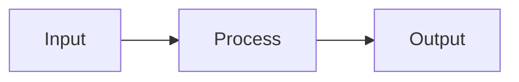

# Browns Data Science Documentation System

This folder contains the public-facing documentation website for Data Science & AI projects at Browns Shoes. The documentation system is designed to help you ship professional project documentation fast while maintaining consistency.

## Quick Start

### Creating New Project Documentation

1. **Copy the template**
   ```bash
   cp template.md your-project-name/index.md
   ```

2. **Fill in the sections** following the template structure

3. **Add to main index** - Update `index.md` with your project link

4. **Commit and push** - Your docs will be live in minutes!

## Documentation Structure

```
docs/
├── README.md                # This file
├── PROJECT_TEMPLATE.md      # Comprehensive guide
├── template.md             # Copy this for new projects
├── index.md                # Main landing page
├── _config.yml             # Jekyll configuration
├── assets/
│   └── css/
│       └── style.scss      # Custom styling
└── [project-name]/         # Individual project folders
    └── index.md            # Project documentation
```

## Key Features

### 🎨 Design System
- **Montserrat font** for clean, modern typography
- **Black and white aesthetic** matching Browns' brand
- **Responsive two-column layout** for desktop and mobile
- **Mermaid diagram support** for technical visualizations

### 📝 Standard Sections
Each project documentation includes:
- **Project metadata** (owner, status, demo link)
- **Problem statement** with business context
- **Solution overview** in bullet points
- **Business impact** with metrics
- **Technical architecture** with diagram
- **Component details** for developers

### 🚀 Fast Shipping
- Pre-built template with all sections
- Copy-paste examples in PROJECT_TEMPLATE.md
- Consistent styling automatically applied
- Mobile-responsive without extra work

## Viewing the Site

The documentation is hosted on GitHub Pages:
```
https://alassanedialdiop.github.io/browns_data_science/
```

## Best Practices

1. **Start with the problem** - Clear problem statements guide everything else
2. **Use real metrics** - "Saves 2 hours/week" better than "saves time"
3. **Include diagrams** - Visual explanations improve understanding
4. **Keep it concise** - Each section should be scannable
5. **Update regularly** - Keep status and metrics current

## Adding New Projects

### Method 1: Quick Start
1. Copy `template.md` to `your-project/index.md`
2. Fill in all placeholders
3. Add project to main `index.md`
4. Commit and push

### Method 2: From Scratch
1. Create folder: `mkdir docs/your-project/`
2. Create `index.md` following the template
3. Add Mermaid diagrams and content
4. Update navigation in main index
5. Test locally if needed
6. Deploy to GitHub Pages

## Advanced Features

### Mermaid Diagrams


### Custom Styling
All projects automatically get:
- Consistent typography
- Responsive layouts
- Professional appearance
- Emoji support
- Code highlighting

### Project Status Badges
- 🚀 **Production** - Live and operational
- 🧪 **Pilot** - Testing phase
- 📋 **Development** - Under construction
- ✅ **Completed** - Project finished
- 🔄 **Maintenance** - Ongoing support

## Resources

- **Template Guide**: See `PROJECT_TEMPLATE.md` for detailed instructions
- **Quick Template**: Copy `template.md` to start fast
- **Example**: Browns Lens in `browns-lens/` shows a complete implementation
- **Styling**: Customize in `assets/css/style.scss`

## Tips for Success

1. **Documentation is part of shipping** - Don't wait until the end
2. **Show, don't just tell** - Include screenshots and diagrams
3. **Write for two audiences** - Business users and developers
4. **Keep it updated** - Stale docs are worse than no docs
5. **Get feedback** - Share drafts with stakeholders early

## Note

This documentation platform is designed to be viewable by anyone with the link, while keeping the actual code repository private. Perfect for sharing project impact with stakeholders while protecting implementation details.