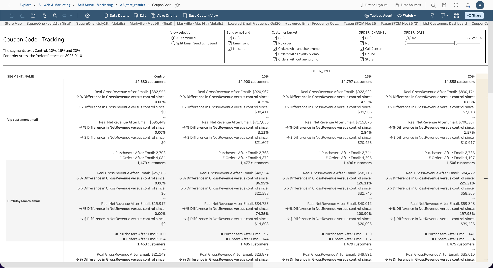
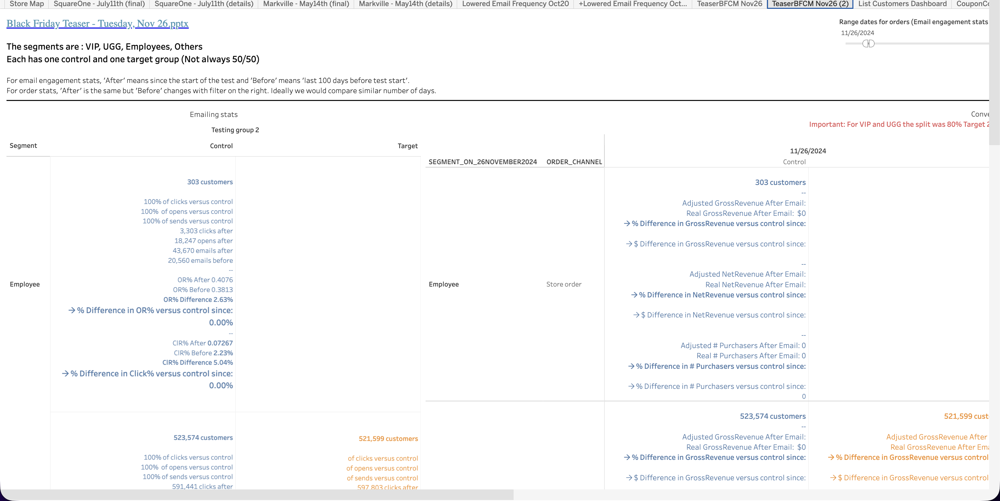

  <h1>AB Test Results</h1>
  <a class="report-link" href="https://prod-ca-a.online.tableau.com/#/site/brownsshoes/workbooks/1374793/views">Open in Tableau</a>

  
<strong>Status:</strong> Broken

  
<strong>Category:</strong> Others

  
<strong>Last updated:</strong> February 22, 2026

> **Note:** This report is archived for reference and inspiration if A/B testing comes back.

  

    <button class="tab-btn active" data-tab="tab-coupon">Coupon Code - Tracking</button>
    <button class="tab-btn" data-tab="tab-ab">AB test results</button>
  

  

    
Coupon code A/B test tracking across segments (VIP, customers email, birthday). Compares gross/net revenue, purchases, and customer counts after email send vs control group with % difference calculations.

    
  

  

    
A/B test results for various campaigns (SquareOne, Markvile, Black Friday Teaser, etc.). Shows email engagement stats (opens, clicks, OR%, CR%) and order stats (gross/net revenue, # purchasers) comparing control vs target groups with a 50/50 or 80/20 split.

    
  

## Context

Historical A/B testing dashboard used to measure the impact of email campaigns and coupon codes on customer behavior. Currently broken and not maintained. Kept as a reference for the approach and layout if A/B testing initiatives are restarted.
