# [Browns Lens – Real-time SKU Recognition](../)

  

    
<strong>Project:</strong> Browns Lens – Shoe recognition

    
<strong>Status:</strong> 🚀 Testing (V5 - Snowflake Native)

    
<strong>Demo:</strong> <a href="https://app.snowflake.com/browns/prod/#/streamlit-apps/PROD_SANDBOX.ADIOP.NVX6HS9JXW6RG993?ref=snowsight_shared">Live Demo</a>

    
<strong>Code:</strong> <a href="./code">V5 Source Code</a>

  

## 🔗 Quick Links

- **[📋 V5 Source Code](./code)** – Complete working code for deployment
- **[🚀 Live Demo](https://app.snowflake.com/browns/prod/#/streamlit-apps/PROD_SANDBOX.ADIOP.NVX6HS9JXW6RG993?ref=snowsight_shared)** – Deployed Test Application

## 📈 Good to know
- Prototype works for **Men* shoes in the catalog as of July31

## 💡 Solution  
- **Snowflake Streamlit** with native camera input for instant photo capture
- **AI_EMBED** processes images using voyage-multimodal-3 in <2s
- **Snowflake vector DB** finds top-5 matches from  shoe catalog

## 🔧 How Browns Lens Works

### V5 Architecture: Snowflake Native Processing

```mermaid
graph TB
    %% Title styling
    subgraph Build["<b>Build Catalog (Pre-computed)</b>"]
        A[📷 Product Photos] --> B[🖼️ Pre-processing]
        B --> C["🧠 AI_EMBED<br/><i>voyage-multimodal-3<br/>1024-dim vectors</i>"]
        C --> D[💾 Vector Storage]
    end
    
    subgraph V5["<b>V5: Snowflake Native</b>"]
        E[📱 st.camera_input] --> F[⚡ Stage Upload]
        F --> G["🧠 AI_EMBED<br/><i>voyage-multimodal-3</i>"]
        G --> H[🔍 Vector Search]
    end
    
    D --> DB[("❄️ Snowflake<br/>Vector Database<br/><i>X products</i>")]
    
    DB --> H
    H --> R["👟 <b>Top 5 Products</b><br/><i>Multi-face scoring</i>"]
    
    %% V5 Features
    subgraph Features["<b>V5 Features</b>"]
        I[📄 Single File Deploy]
        J[🔄 Auto-search]
        K[⚡ session.file.put]
    end
    
    %% Styling
    classDef buildStyle fill:#fff,stroke:#000,stroke-width:2px
    classDef v5Style fill:#e3f2fd,stroke:#2196f3,stroke-width:3px
    classDef embedStyle fill:#e8eaf6,stroke:#9fa8da,stroke-width:2px
    classDef dbStyle fill:#fff3e0,stroke:#ffb74d,stroke-width:3px
    classDef matchStyle fill:#f3e5f5,stroke:#ba68c8,stroke-width:2px
    classDef resultStyle fill:#e8f5e9,stroke:#66bb6a,stroke-width:3px
    classDef featureStyle fill:#f1f8e9,stroke:#8bc34a,stroke-width:2px
    
    class A,B,D buildStyle
    class E,F,G,H v5Style
    class C,G embedStyle
    class DB dbStyle
    class R resultStyle
    class I,J,K featureStyle
```

## 🛠️ Technical Components (V5)

### 🎥 Frontend Layer
**Snowflake Streamlit + st.camera_input** – Native camera access directly in Snowflake environment with instant photo capture. Auto-processing triggers immediately when photo is taken, eliminating need for external streaming or plugins. Clean black/white Montserrat UI for professional retail environment.

### 🧠 ML Processing  
**Snowflake AI_EMBED (voyage-multimodal-3)** – Converts shoe images into 1024-dimensional vectors using Snowflake's native AI functions. voyage-multimodal-3 is optimized for visual understanding with superior accuracy on fashion/retail imagery. Processes images directly within Snowflake's secure environment.

### ⚡ Compute Layer
**Snowflake Native Session** – All processing happens within Snowflake using `get_active_session()`. Images uploaded via `session.file.put()` to internal stages, eliminating external dependencies. Processing time ~2 seconds including upload, embedding, and search.

### ❄️ Vector Storage & Search
**Snowflake Vector Database** – Pre-computed embeddings for X products stored natively. Advanced multi-face scoring algorithm averages similarity across multiple product angles (faces 1-4) for improved accuracy. Uses `VECTOR_COSINE_SIMILARITY` for ultra-fast matching.

### 🚀 Deployment
**Single-File Streamlit App** – Complete application in one `app.py` file with embedded database class. No external infrastructure, containers, or services required. Deploy directly to Snowflake Streamlit with simple upload. Built-in error handling and file cleanup.

---

*Last updated: 2025-08-01* **V5.0** - Snowflake Native