# [Browns Lens – Real-time SKU Recognition](../)

  

    
<strong>Project:</strong> Browns Lens – SKU-on-Camera

    
<strong>Owner:</strong> Alassane Diop — Data Science / AI

    
<strong>Status:</strong> 🧪 Pilot (2 stores)

    
<strong>Demo:</strong> <a href="https://browns-internal/browns-lens">Live Demo</a>

  

## 🎯 Problem
Associates waste **~90 seconds** per customer typing style codes or flipping through catalogs to find products in the vitrine.

## 💡 Solution  
- **Streamlit app** with WebRTC camera captures frames every 2 seconds
- **AWS Lambda** processes images using CLIP embeddings in <300ms
- **Snowflake vector DB** finds top-5 matches from 50,000+ shoe catalog

## 📈 Why It Matters
- Cuts lookup time **-80s per interaction** → **2 hours saved/associate/week**
- Achieves **>95% top-5 recall** accuracy in pilot testing
- Frees staff for upselling → projected **+1% conversion rate**
- Clean, simple UI with Montserrat font and black/white aesthetic

## 🔧 How Browns Lens Works

### High-level Diagram of How Browns Lens Works Behind the Scenes

```mermaid
graph TB
    %% Title styling
    subgraph Build["<b>Build Catalog</b>"]
        A[📷 Product Photos] --> B[🖼️ Pre-processing]
        B --> C["🧠 CLIP Embeddings<br/><i>768-dim vectors</i>"]
        C --> D[💾 Vector Storage]
    end
    
    subgraph Recognize["<b>Recognize Shoe</b>"]
        E[📱 Camera Capture] --> F[⚡ Live Processing]
        F --> G["🧠 CLIP Embeddings<br/><i>Real-time</i>"]
    end
    
    D --> DB[("🗄️ Snowflake<br/>Vector Database<br/><i>50K+ products</i>")]
    
    DB --> M["🔍 Similarity<br/>Matching"]
    G --> M
    
    M --> R["👟 <b>Top 5 Products</b>"]
    
    %% Styling
    classDef buildStyle fill:#fff,stroke:#000,stroke-width:2px
    classDef recognizeStyle fill:#fff,stroke:#000,stroke-width:2px
    classDef embedStyle fill:#e8eaf6,stroke:#9fa8da,stroke-width:2px
    classDef dbStyle fill:#fff3e0,stroke:#ffb74d,stroke-width:3px
    classDef matchStyle fill:#f3e5f5,stroke:#ba68c8,stroke-width:2px
    classDef resultStyle fill:#e8f5e9,stroke:#66bb6a,stroke-width:3px
    
    class A,B,D buildStyle
    class E,F recognizeStyle
    class C,G embedStyle
    class DB dbStyle
    class M matchStyle
    class R resultStyle
```

## 🛠️ Technical Components

### 🎥 Frontend Layer
**Streamlit + WebRTC** – Provides real-time camera access through web browsers, capturing frames automatically every 2 seconds. WebRTC ensures low-latency video streaming without requiring any plugins or downloads, making it seamless for store associates to use on any device.

### 🧠 ML Processing  
**OpenAI CLIP (ViT-B/32)** – Converts shoe images into 768-dimensional vectors that capture visual features. CLIP (Contrastive Language-Image Pre-training) understands both images and text, trained on 400M image-text pairs. This allows it to recognize shoes even from different angles, lighting conditions, or partial views.

### ⚡ Compute Layer
**AWS Lambda + Flask** – Serverless functions that automatically scale based on demand, processing each image in under 300ms. Lambda eliminates the need for managing servers and only charges for actual compute time used. Flask provides a lightweight API framework for handling requests.

### ❄️ Vector Storage
**Snowflake Vector Database** – Stores pre-computed embeddings for our entire 50,000+ product catalog. Uses cosine similarity for ultra-fast nearest neighbor search, returning the most visually similar products in milliseconds. Snowflake's distributed architecture ensures consistent performance even as our catalog grows.

### 🐳 Deployment
**Docker on AWS** – Containerized deployment ensures consistent environments across development, testing, and production. Docker images package all dependencies, making deployments reliable and rollbacks simple. AWS provides the infrastructure with auto-scaling and high availability.

---

*Last updated: 2025-07-23* v1.11