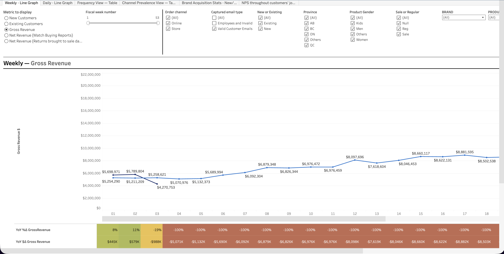
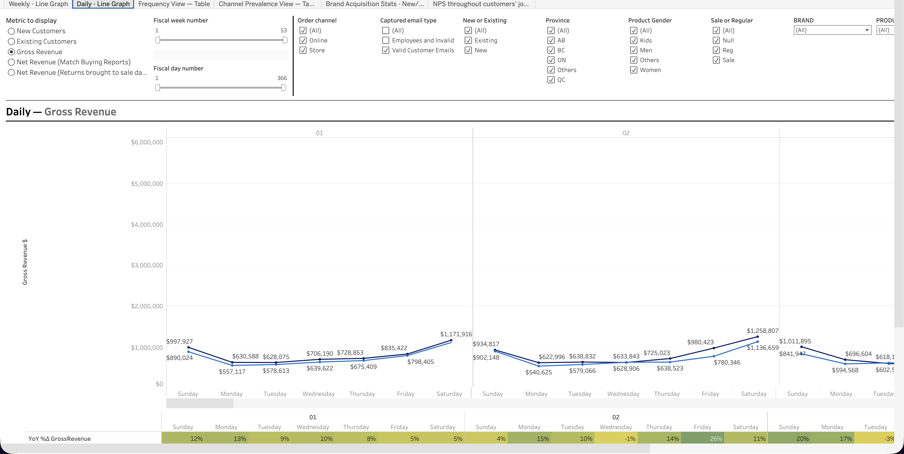
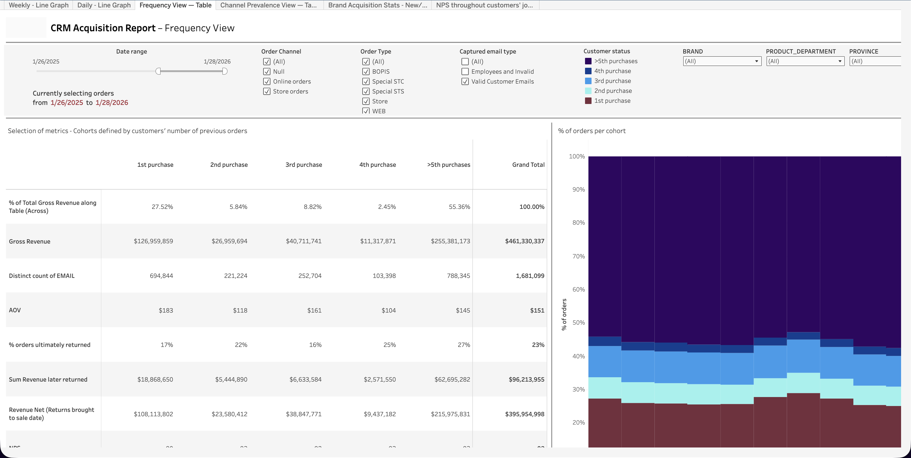
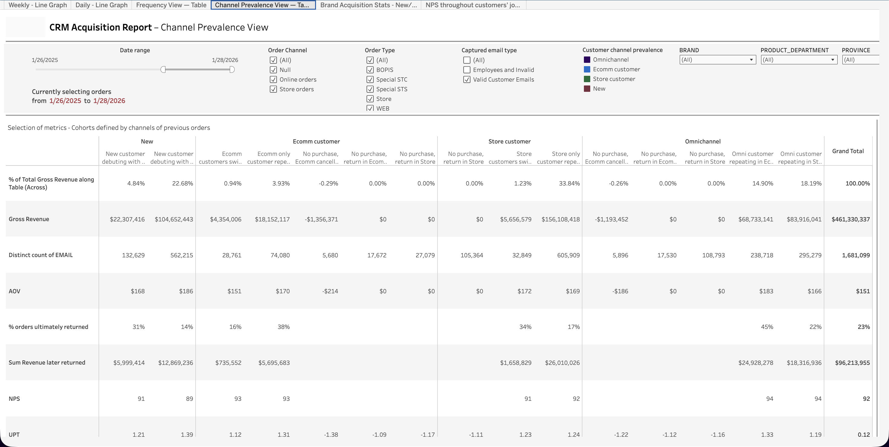
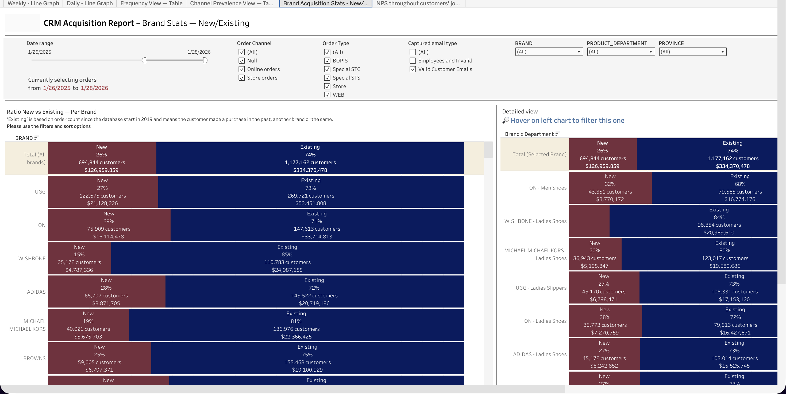
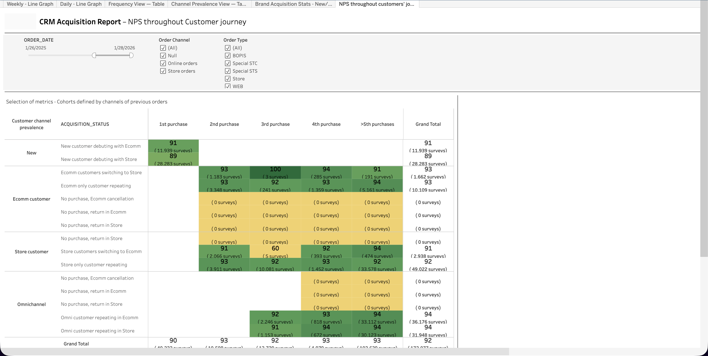

  <h1>CRM Acquisition Report</h1>
  <a class="report-link" href="https://prod-ca-a.online.tableau.com/#/site/brownsshoes/workbooks/1034178/views">Open in Tableau</a>

  
<strong>Status:</strong> Production

  
<strong>Category:</strong> Marketing / CRM

  
<strong>Last updated:</strong> February 21, 2026

  

    <button class="tab-btn active" data-tab="tab-weekly">Weekly - Line Graph</button>
    <button class="tab-btn" data-tab="tab-daily">Daily - Line Graph</button>
    <button class="tab-btn" data-tab="tab-frequency">Frequency View</button>
    <button class="tab-btn" data-tab="tab-channel">Channel Prevalence</button>
    <button class="tab-btn" data-tab="tab-brand">Brand Acquisition Stats</button>
    <button class="tab-btn" data-tab="tab-nps">NPS Journey</button>
  

  

    
Weekly gross revenue trend with year-over-year comparison. Tracks new customers, existing customers, gross revenue, net revenue (match buying reports), and net revenue (returns brought to sale date). Filters by fiscal week, order channel, captured email type, new/existing status, province, product gender, brand, and sale/regular.

    
  

  

    
Daily gross revenue breakdown showing new vs existing customer contribution. Same metric and filter options as the weekly view, with an additional fiscal day number slider for granular date selection.

    
  

  

    
Purchase cohort analysis -- metrics broken down by customers' number of previous orders (1st purchase through 5th+ purchase). Shows % of total gross revenue, gross revenue, distinct email count, AOV, % orders ultimately returned, sum revenue later returned, and revenue net of returns. Includes a stacked bar chart showing % of orders per cohort.

    
  

  

    
Revenue and metrics sliced by customer channel prevalence -- new customers, ecomm customers, store customers, and omnichannel customers. Each segment is further broken down by acquisition pattern (debuting with ecomm, switching to store, repeating in ecomm, etc.). Tracks gross revenue, distinct email count, AOV, % returned, NPS, and UPT.

    
  

  

    
Brand-level breakdown of new vs existing customer ratio. Shows customer count and gross revenue for each brand (UGG, Wishbone, Adidas, Michael Kors, Browns, etc.) with a detailed view drilling into brand x department combinations. Highlights acquisition strength by brand.

    
  

  

    
NPS scores mapped across the customer journey -- rows represent customer channel prevalence and acquisition status, columns represent purchase number (1st through 5th+). Heatmap coloring highlights where satisfaction peaks and dips across different customer segments and journey stages.

    
  

## Context

Unified view of customer acquisition and retention performance across all channels. Combines revenue trends (weekly/daily), purchase frequency cohort analysis, channel prevalence breakdowns, brand-level acquisition metrics, and NPS tracking throughout the customer journey. Designed to answer: where are new customers coming from, how do they behave over time, and which brands drive acquisition vs retention?

## Data Source

**Snowflake model:** `P_BI.MARKETING.UNIFIED_ACQUISITION_LINES`
