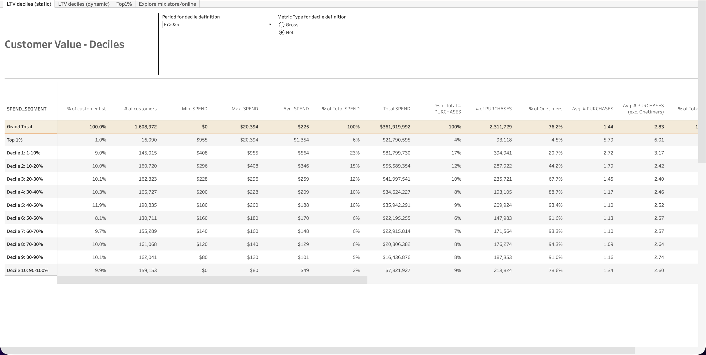
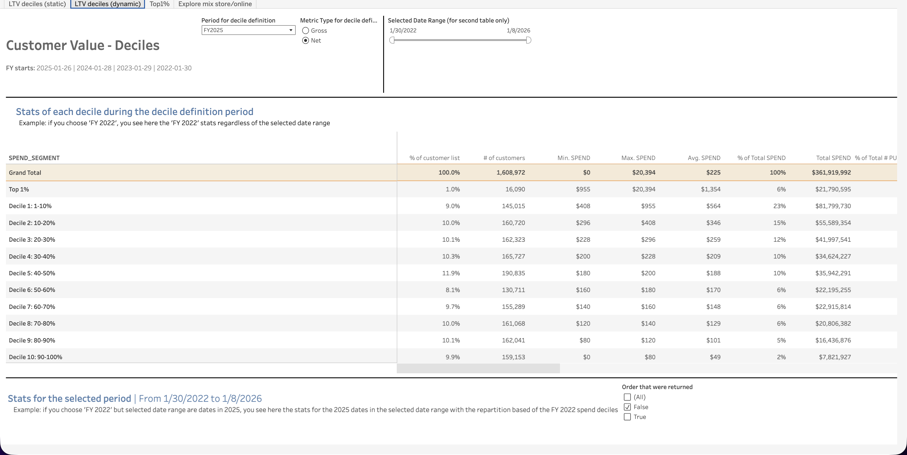
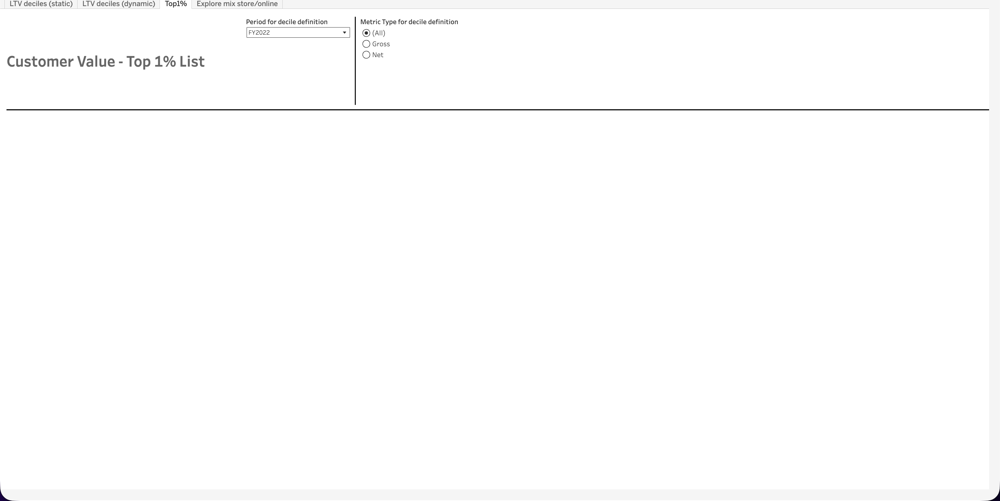
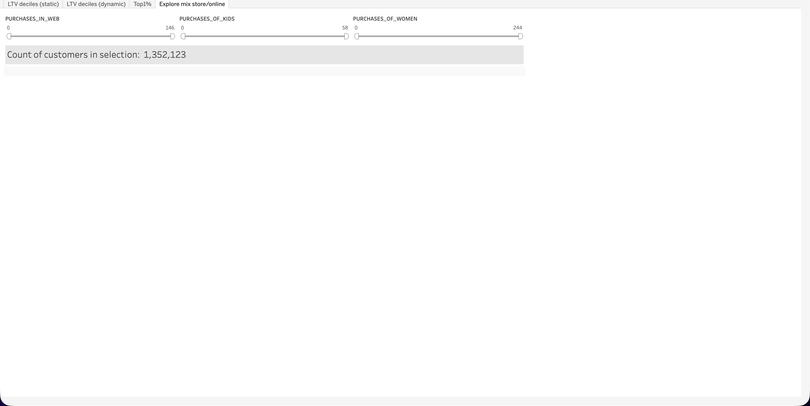

  <h1>CRM Loyalty (dev)</h1>
  <a class="report-link" href="https://prod-ca-a.online.tableau.com/#/site/brownsshoes/workbooks/1766202/views">Open in Tableau</a>

  
<strong>Status:</strong> Broken

  
<strong>Category:</strong> Marketing / Self-Serve

  
<strong>Last updated:</strong> February 22, 2026

  

    <button class="tab-btn active" data-tab="tab-static">LTV deciles (static)</button>
    <button class="tab-btn" data-tab="tab-dynamic">LTV deciles (dynamic)</button>
    <button class="tab-btn" data-tab="tab-top1">Top1%</button>
    <button class="tab-btn" data-tab="tab-explore">Explore mix store/online</button>
  

  

    
Customer value deciles table based on a fixed fiscal year period. Breaks the customer base into spend segments (Top 1%, Decile 1-10%) showing # of customers, min/max/avg spend, % of total spend, total purchases, % onetimers, and avg purchases per customer. Metric type toggles between Gross and Net.

    
  

  

    
Dynamic version of the deciles view with a selectable date range comparison. Shows two tables: stats for the decile definition period (fiscal year) and stats for the selected date range using the same decile repartition. Allows tracking how each spend segment's behavior evolves across different time windows. Includes return order filter.

    
  

  

    
Customer Value - Top 1% List. Intended to display the top 1% of customers by spend with individual-level detail. Currently broken -- page loads with filters but no data renders.

    
  

  

    
Explore mix store/online. Slider filters for purchases in web, kids, and women categories with a customer count. Currently broken -- only filter controls render with no visualization output.

    
  

## Context

Customer lifetime value and loyalty segmentation dashboard. Segments the customer base into spend deciles to understand value distribution, spending patterns, and one-time vs repeat buyer ratios. Originally designed to also include a Top 1% customer list and a store/online purchase mix explorer, but those tabs are currently non-functional.

## Data Source

**Snowflake model:** `PROD_SANDBOX.ADIOP.customer_spend_summary`
