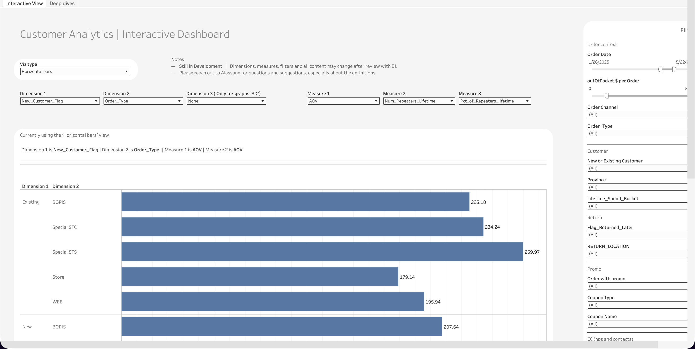
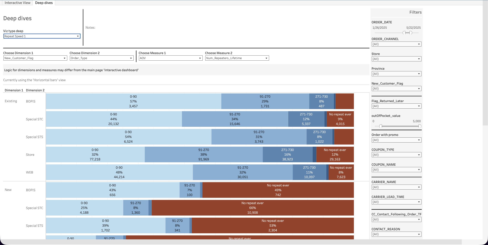

  <h1>Customer Analytics - Exploration Dashboard</h1>
  <a class="report-link" href="https://prod-ca-a.online.tableau.com/#/site/brownsshoes/workbooks/1235059/views">Open in Tableau</a>

  
<strong>Status:</strong> Production

  
<strong>Category:</strong> Others

  
<strong>Last updated:</strong> February 22, 2026

  

    <button class="tab-btn active" data-tab="tab-interactive">Interactive View</button>
    <button class="tab-btn" data-tab="tab-deep">Deep dives</button>
  

  

    
Configurable bar chart for ad-hoc exploration of customer order data. Users select up to 3 dimensions (e.g. New_Customer_Flag, Order_Type) and 3 measures (e.g. AOV, Num_Repeaters_Lifetime, Pct_of_Repeaters_Lifetime). Right-side filter panel covers order date, order channel, order type, new/existing status, province, spend bucket, return flags, promo, coupon type, and more.

    
  

  

    
Stacked bar chart showing repeat purchase distribution across time buckets (0-90 days, 91-270, 271-730, No repeat ever) broken down by selected dimensions. Designed for deeper investigation into customer retention patterns by order type, channel, and customer segment. Includes additional filters for carrier, lead time, and contact reason.

    
  

## Context

Self-serve exploration dashboard for customer analytics. Allows stakeholders to slice order history data across any combination of dimensions and measures without needing to request custom analysis. The Interactive View supports quick comparisons, while Deep dives focuses on repeat purchase behavior and retention patterns.

## Data Source

**Snowflake model:** `PROD_SANDBOX.ADIOP.lean_order_history_customer_analytics`
