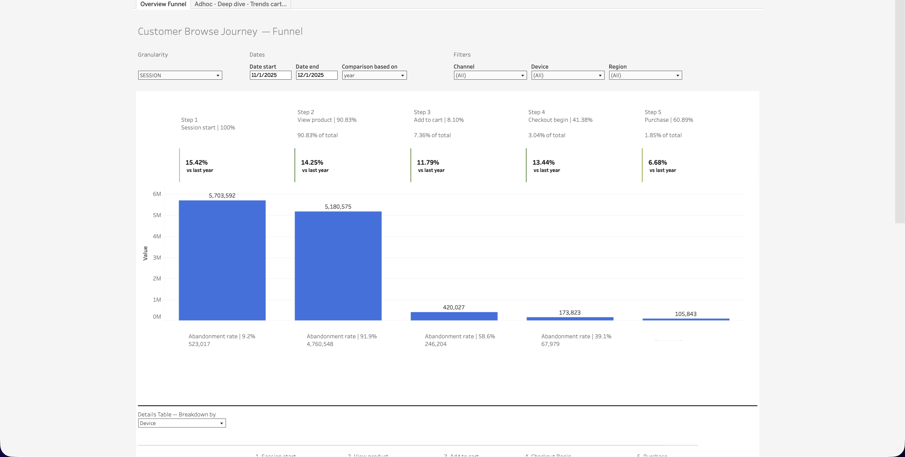
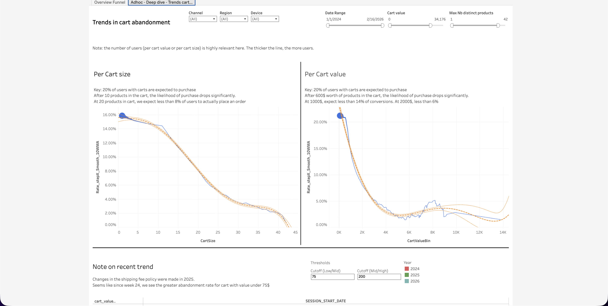

  <h1>Customer Browse Journey</h1>
  <a class="report-link" href="https://prod-ca-a.online.tableau.com/#/site/brownsshoes/workbooks/1587025/views">Open in Tableau</a>

  
<strong>Status:</strong> Production

  
<strong>Category:</strong> Marketing / Self-Serve

  
<strong>Last updated:</strong> February 22, 2026

  

    <button class="tab-btn active" data-tab="tab-funnel">Overview Funnel</button>
    <button class="tab-btn" data-tab="tab-cart">Adhoc - Deep dive - Trends cart</button>
  

  

    
Five-step conversion funnel from session start to purchase. Each step shows volume, percentage of total, and year-over-year change. Abandonment rates displayed at each stage (e.g. 91.9% drop-off between View product and Add to cart). Filterable by granularity (session), date range, channel, device, and region. Includes a details table with breakdown by device at the bottom.

    
  

  

    
Cart abandonment deep dive showing conversion rate curves by cart size (number of products) and cart value (dollar amount). Key insights: ~20% of users with carts are expected to purchase; after 10 products or $600 in cart, conversion drops significantly. Includes year-over-year trend comparison (2024 vs 2025 vs 2026) with configurable threshold cutoffs. Notes on recent shipping fee policy changes impacting abandonment rates.

    
  

## Context

Tracks the full customer browse-to-purchase journey on the ecommerce site. The Overview Funnel provides a high-level view of where customers drop off, while the cart trends deep dive investigates the relationship between cart size/value and conversion likelihood. Used to monitor funnel health, identify friction points, and measure the impact of policy changes (e.g. shipping fees) on purchase completion.

## Data Source

**Snowflake model:** `prod_analyze.web_traffic.session_funnel_steps`
