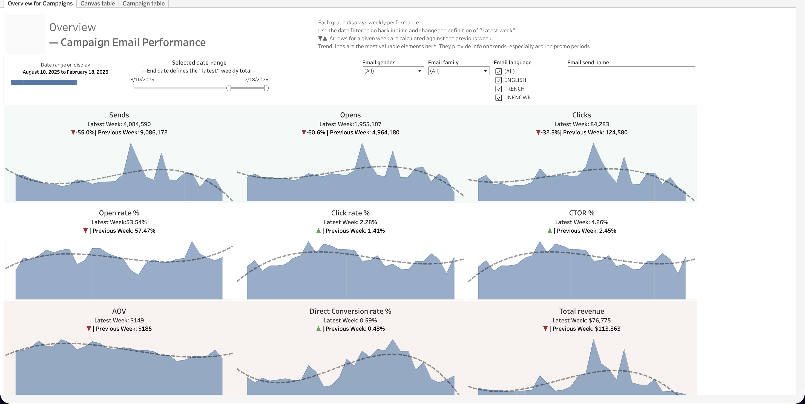
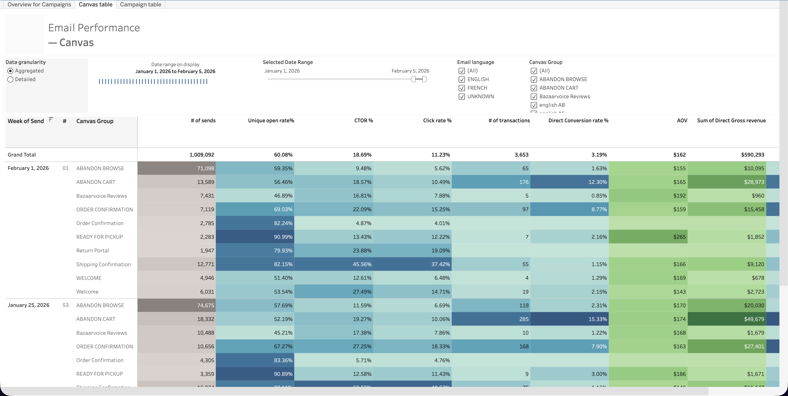
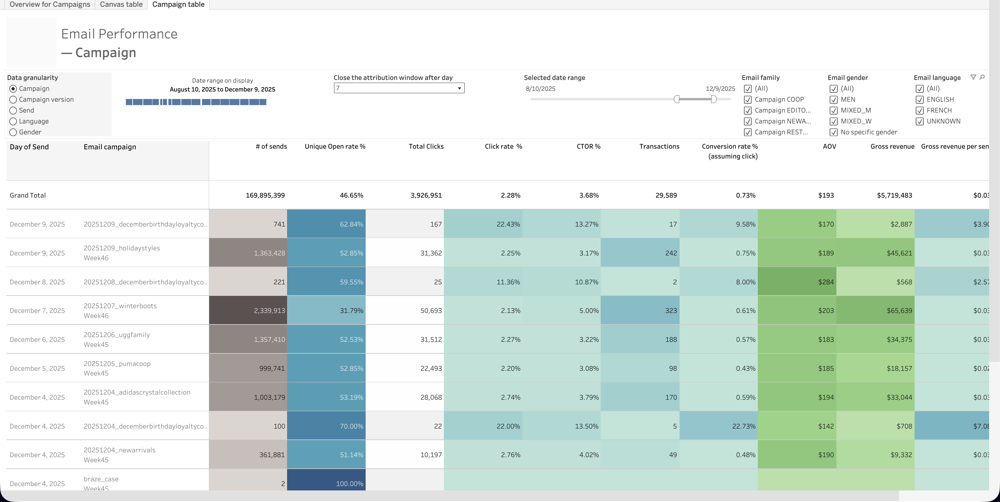

  <h1>Email Performance Report</h1>
  <a class="report-link" href="https://prod-ca-a.online.tableau.com/#/site/brownsshoes/workbooks/1032466/views">Open in Tableau</a>

  
<strong>Status:</strong> Production

  
<strong>Category:</strong> Marketing / CRM

  
<strong>Last updated:</strong> February 21, 2026

  

    <button class="tab-btn active" data-tab="tab-overview">Overview for Campaigns</button>
    <button class="tab-btn" data-tab="tab-canvas">Canvas table</button>
    <button class="tab-btn" data-tab="tab-campaign">Campaign table</button>
  

  

    
Weekly trend charts for all key email metrics -- sends, opens, clicks, open rate, click rate, CTOR, AOV, direct conversion rate, and total revenue. Arrows show week-over-week direction, trend lines highlight seasonal patterns (especially around promo periods).

    
  

  

    
Performance breakdown by Canvas Group (Abandon Browse, Abandon Cart, Order Confirmation, Ready for Pickup, etc.) with sends, unique open rate, CTOR, click rate, transactions, direct conversion rate, AOV, and revenue. Supports aggregated and detailed granularity.

    
  

  

    
Performance breakdown by individual email campaign with drill-down by campaign version, send, language, and gender. Same metrics as Canvas table -- sends, unique open rate, clicks, CTOR, transactions, conversion rate, AOV, gross revenue.

    
  

## Context

Centralized view of email marketing performance across both **campaigns** (one-time sends) and **canvases** (automated flows like abandon cart, order confirmation, welcome sequences). Tracks the full funnel from send to revenue, with configurable attribution windows and filters by email family, gender, and language.

## Data Sources

| Model | Description |
|-------|-------------|
| `P_BI.DIGITAL.email_campaign_performance` | Campaign-level email metrics |
| `P_BI.DIGITAL.email_canvas_performance` | Canvas/automated flow metrics |
| `P_BI.DIGITAL.EMAIL_REVENUE_ATTRIBUTION` | Revenue attribution for email touches |
