# [Multitouch Attribution – Customer Journey Analytics](../)

  

    
<strong>Project:</strong> Multitouch Attribution Model

    
<strong>Owner:</strong> Alassane Diop — Data Science / AI

    
<strong>Status:</strong> Passed to BI 

  

## 📊 Problem
Marketing teams only see the **last touchpoint** before purchase, missing the complete customer journey. This leads to:
- Undervaluing awareness channels (SEO, Social)
- Overinvesting in bottom-funnel tactics
- Missing synergies between channels

## 💡 Solution  
**3-step modular SQL design** that tracks all customer touchpoints:
- **Step A**: Capture all sessions within attribution windows
- **Step B**: Apply 5 attribution strategies 
- **Step C**: Format output matching production tables
- Supports **7, 14, and 28-day** attribution windows
- **98.43% alignment** with existing last-click model

## 📈 Why It Matters
- **True ROI** → See which channels initiate vs close sales
- **Better budgeting** → Credit fairly channels that start journeys
- **Journey insights** → 45% of customers touch 2+ channels
- **Flexibility** → Compare attribution models side-by-side
- **Future-proof** → Easy to add new strategies

## 🔧 How Multitouch Attribution Works

### Simple 3-Step Architecture

```mermaid
graph TD
    %% Step A: Session Collection
    subgraph StepA["<b>Step A: Session Collection</b>"]
        A1[Web Orders] --> A2[Match Sessions]
        A2 --> A3["Sessions within<br/>Attribution Window<br/><i>(7, 14, 28 days)</i>"]
    end
    
    %% Step B: Attribution Logic
    subgraph StepB["<b>Step B: Attribution Strategies</b>"]
        B1["Apply 5 Methods:<br/>• LastTouch<br/>• FirstTouch<br/>• Frequency<br/>• EqualWeight<br/>• Custom Mix"]
        B1 --> B2[Daily Journey<br/>Aggregation]
    end
    
    %% Step C: Final Output
    subgraph StepC["<b>Step C: Format Output</b>"]
        C1[Match Production<br/>Table Structure]
        C1 --> C2[Add Attribution<br/>Dimensions]
    end
    
    %% Flow connections
    A3 --> B1
    B2 --> C1
    
    %% Final outputs
    C2 --> D1[📊 Daily Attribution Table]
    
    %% Styling
    classDef stepStyle fill:#f9f9f9,stroke:#333,stroke-width:2px
    classDef outputStyle fill:#e8f5e9,stroke:#66bb6a,stroke-width:3px
    
    class StepA,StepB,StepC stepStyle
    class D1 outputStyle
```

## 🛠️ Technical Architecture

### Step A: Session-Level Data Collection
**File**: `multitouch_stepA_ordered_sessions.sql`

Captures the complete customer journey by:
- Starting with all web orders in the date range
- Finding all customer sessions before each order
- Supporting multiple attribution windows (7, 14, 28 days)
- Preserving the "truth" session that generated the order
- Handling edge cases (cancelled orders, missing emails)

**Key Idea**: Each order appears 3 times (once per attribution window), allowing flexible analysis without reprocessing.

### Step B: Attribution Strategy Application  
**File**: `multitouch_stepB_prep.sql`

Applies 5 different attribution models:

1. **LastTouch**: 100% credit to final touchpoint (matches current production)
2. **FirstTouch**: 100% credit to initial touchpoint  
3. **Frequency**: Credit to most frequent channel in journey
4. **EqualWeight**: Split credit equally across all touchpoints
5. **Custom Mix**: Balanced 25% blend of all strategies

**Output**: Pre-aggregated daily journeys by strategy, ready for analysis.

### Step C: Production-Ready Formatting
**File**: `multitouch_stepC_daily_agg.sql`

Transforms attribution results to match existing table structure:
- All original columns preserved (dates, sales, sessions)
- Adds `journey_method` column for attribution strategy
- Adds `attribution_window_days` column
- Maintains backward compatibility
- Zero changes needed for existing reports

---

*Last updated: 2025-07-24* v1.0