# [Multitouch Attribution – Customer Journey Analytics](../)

<div class="project-header">
  <div class="project-meta">
    <div><strong>Project:</strong> Multitouch Attribution Model</div>
    <div><strong>Snowflake Folder:</strong> <a>https://app.snowflake.com/browns/prod/#/multitouch-fDDh2Mqff</a></div>
    <div><strong>Status:</strong> ✅ Confirmed - Handover to BI </div>
  </div>
</div>

<div class="two-column-layout">

<div class="column-left">

## 📊 Problem
Marketing team only see the **last touchpoint** before purchase, missing the complete customer journey. This leads to:
- Undervaluing awareness channels (SEO, Social)
- Overinvesting in bottom-funnel tactics
- Missing synergies between channels

## 💡 Solution  
**3-step modular SQL design** that tracks all customer touchpoints:
- **Step A**: Capture all sessions within attribution windows
- **Step B**: Apply 5 attribution strategies 
- **Step C**: Format output matching production tables
- Supports **7, 14, and 28-day** attribution windows

## 📈 Why It Matters
- **True ROI** → See which channels initiate vs close sales
- **Better budgeting** → Credit fairly channels that start journeys
- **Journey insights** → 45% of customers touch 2+ channels
- **Flexibility** → Compare attribution models side-by-side
- **Future-proof** → Easy to add new strategies

</div>

<div class="column-right">

## 🔧 How Multitouch Attribution Works

### Data Flow & Granularity

```mermaid
graph TD
    %% Source Tables
    subgraph Sources["<b>Source Tables (DAG Dependencies)</b>"]
        S1[📊 UNIFIED_LINEITEMS_WITH_SFCC<br/><i>Order details</i>]
        S2[🔍 SESSION_ORDERS<br/><i>Truth sessions</i>]
        S3[👥 SESSIONS<br/><i>All web sessions</i>]
        S4[📧 DS_CUSTOMER_INFO<br/><i>Email mapping</i>]
    end
    
    %% Step A: Session Collection
    subgraph StepA["<b>Step A: Session Collection</b><br/><i>Granularity: order_id × session_id × window</i>"]
        A1["Output: MULTITOUCH_ORDERED_SESSIONS<br/><b>Keys:</b> order_id, session_id, attribution_window_days<br/><b>Rows:</b> ~2.5M YTD(all sessions for all orders)"]
    end
    
    %% Step B: Attribution Logic
    subgraph StepB["<b>Step B: Attribution & Aggregation</b><br/><i>Granularity: date × method × journey</i>"]
        B1["Apply 5 Attribution Methods"]
        B2["<b>AGGREGATE:</b> Sessions → Daily Journeys<br/><b>Keys:</b> order_date, journey_method,<br/>province, Steps 1-4, attribution_window<br/><b>Rows:</b> ~1M YTD (unique journey patterns)"]
        B1 --> B2
    end
    
    %% Step C: Final Output
    subgraph StepC["<b>Step C: Production Format</b><br/><i>Granularity: date × channel × region × method × window</i>"]
        C1["Output: Final Attribution Table<br/><b>Keys:</b> calendar_date, channel, region,<br/>journey_method, attribution_window_days<br/><b>Rows:</b> ~500K YTD(all combinations)"]
    end
    
    %% Connections with table names
    S1 --> A1
    S2 --> A1
    S3 --> A1
    S4 --> A1
    
    A1 --> |"3M rows → 50K patterns"| B2
    B2 --> |"Uses prep table"| C1
    S1 --> |"Sales redistribution"| C1
    
    %% Styling
    classDef sourceStyle fill:#e3f2fd,stroke:#1976d2,stroke-width:2px
    classDef stepStyle fill:#f9f9f9,stroke:#333,stroke-width:2px
    classDef aggregateStyle fill:#fff3e0,stroke:#f57c00,stroke-width:3px
    
    class S1,S2,S3,S4 sourceStyle
    class StepA,StepB,StepC stepStyle
    class B2 aggregateStyle
```



</div>

</div>

## 🛠️ Technical Architecture

### Step A: Session-Level Data Collection
**File**: `multitouch_stepA_ordered_sessions.sql`

Captures the complete customer journey by:
- Starting with all web orders in the date range
- Finding all customer sessions before each order
- Supporting multiple attribution windows (7, 14, 28 days)
- Preserving the "truth" session that generated the order
- Handling edge cases (cancelled orders, missing emails)

**Key Idea**: Each order appears 3 times (once per attribution window), allowing flexible analysis without reprocessing.

### Step B: Attribution Strategy Application  
**File**: `multitouch_stepB_prep.sql`

Applies 5 different attribution models:

1. **LastTouch**: 100% credit to final touchpoint (matches current production)
2. **FirstTouch**: 100% credit to initial touchpoint  
3. **Frequency**: Credit to most frequent channel in journey
4. **EqualWeight**: Split credit equally across all touchpoints
5. **Custom Mix**: Balanced 25% blend of all strategies

**Output**: Pre-aggregated daily journeys by strategy, ready for analysis.

### Step C: Production-Ready Formatting
**File**: `multitouch_stepC_daily_agg.sql`

Transforms attribution results to match existing table structure:
- All original columns preserved (dates, sales, sessions)
- Adds `journey_method` column for attribution strategy
- Adds `attribution_window_days` column
- Maintains backward compatibility
- Zero changes needed for existing reports

## 📋 DAG Dependencies & Table Reference

### Input Tables (Must be fresh before running)
```sql
-- Step A Dependencies
PROD_ANALYZE.WEB_TRAFFIC.UNIFIED_LINEITEMS_WITH_SFCC  -- Orders & sales
PROD_ANALYZE.WEB_TRAFFIC.SESSION_ORDERS               -- Order-session mapping
PROD_ANALYZE.WEB_TRAFFIC.SESSIONS                     -- All web sessions
PROD_SANDBOX.ADIOP.DS_CUSTOMER_INFO                  -- Customer emails
PROD_SANDBOX.ADIOP.CUSTOMER_JOURNEY_TIMELINE         -- New/existing flags

-- Step C Additional Dependencies  
PROD_ANALYZE.GENERAL.FISCAL_CALENDAR_EXTENDED        -- Date dimensions
PROD_ANALYZE.WEB_TRAFFIC.MISSING_SESSIONS_MARGIN_MONTHLY -- Corrections
```

### Output Tables Created
```sql
-- Step A Output (Session-level)
PROD_SANDBOX.ADIOP.MULTITOUCH_ORDERED_SESSIONS       -- 3M rows

-- Step B Output (Daily aggregated)
PROD_SANDBOX.ADIOP.MULTITOUCH_DAILY_JOURNEYS_PREP    -- 50K rows

-- Step C Output (Production format)
[Custom table name based on use case]                 -- 500K rows
```

### Data Volume & Performance
- **Step A → B**: Aggregates 3M session rows into 50K daily journey patterns
- **Step B → C**: Expands 50K patterns into 500K channel×date combinations for reporting
- **Full refresh**: ~5 minutes for 1 year of data
- **Incremental**: ~30 seconds for daily append


---

*Last updated: 2025-07-31* v1.0