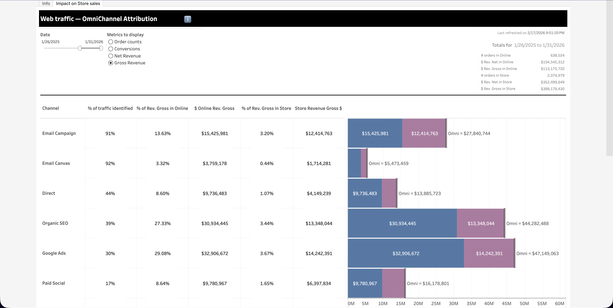

  <h1>OmniChannel Attribution</h1>
  <a class="report-link" target="_blank" href="https://prod-ca-a.online.tableau.com/#/site/brownsshoes/workbooks/1911402/views">Open in Tableau</a>

  
<strong>Status:</strong> Production

  
<strong>Category:</strong> Marketing - Staging

  
<strong>Last updated:</strong> February 21, 2026

  

    <button class="tab-btn active" data-tab="tab-impact">Impact on Store sales</button>
  

  

    
Stacked bar chart showing each channel's online revenue (observed) alongside estimated store revenue. Channels with low identification rates (like Google Ads at ~28%) show the largest uplift. Channels with high identification (like Email at ~97%) show minimal adjustment.

    
  

## Context

This report measures the **full omnichannel impact** of web traffic -- attributing revenue to marketing channels across both online and in-store purchases. When a customer browses on brownshoes.com via Google Ads then buys in-store, we can only attribute that sale if we identified the customer during their web session. For some channels we identify as little as 28% of visitors. This report estimates the hidden store revenue using a statistically-grounded uplift methodology, approved by leadership in February 2026.

## Data Source

**Snowflake model:** `bi_digital_web_traffic_omnichannel_attribution`
