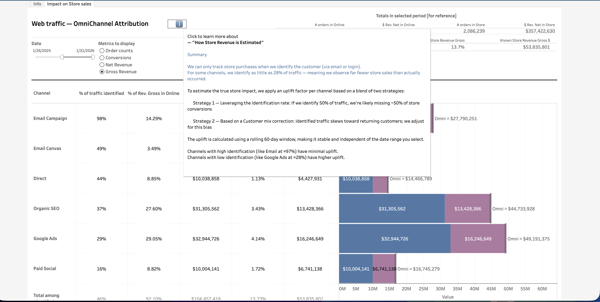

# [OmniChannel Attribution](../)

  

    
<strong>Status:</strong> Production

    
<strong>Category:</strong> CRM Reports

    
<strong>Last updated:</strong> February 2026

  

## Context

This report measures the **full omnichannel impact** of web traffic -- attributing revenue to marketing channels across both online and in-store purchases. When a customer browses on brownshoes.com via Google Ads then buys in-store, we can only attribute that sale if we identified the customer during their web session. For some channels we identify as little as 28% of visitors. This report estimates the hidden store revenue using a statistically-grounded uplift methodology, approved by leadership in February 2026.

## Data Source

**Snowflake model:** `bi_digital_web_traffic_omnichannel_attribution`

  

    <button class="tab-btn active" data-tab="tab-overview">Overview</button>
    <button class="tab-btn" data-tab="tab-methodology">Methodology</button>
  

  

    <h3>Overview -- Channel Impact</h3>
    
Stacked bar chart showing each channel's online revenue (observed) alongside estimated store revenue. Channels with low identification rates (like Google Ads at ~28%) show the largest uplift. Channels with high identification (like Email at ~97%) show minimal adjustment.

    
  

  

    <h3>Methodology -- Uplift Estimation</h3>
    
The uplift factor per channel blends two signals: (1) the identification rate -- channels where we identify fewer visitors have more hidden store conversions, and (2) a customer-mix correction -- identified traffic skews toward returning customers, so we adjust for that bias. The uplift uses a rolling 60-day window, making it stable and independent of the selected date range.

    
  

---

*Last updated: 2026-02-21*
