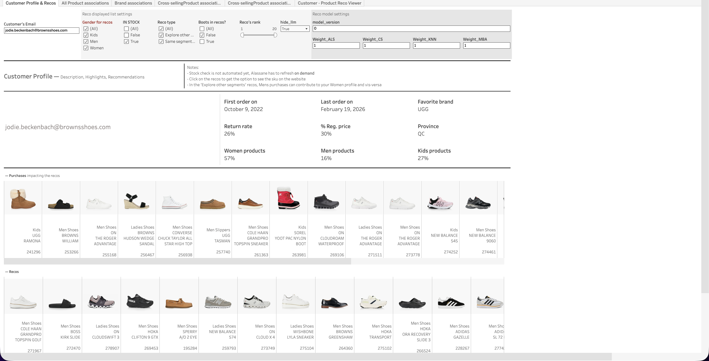
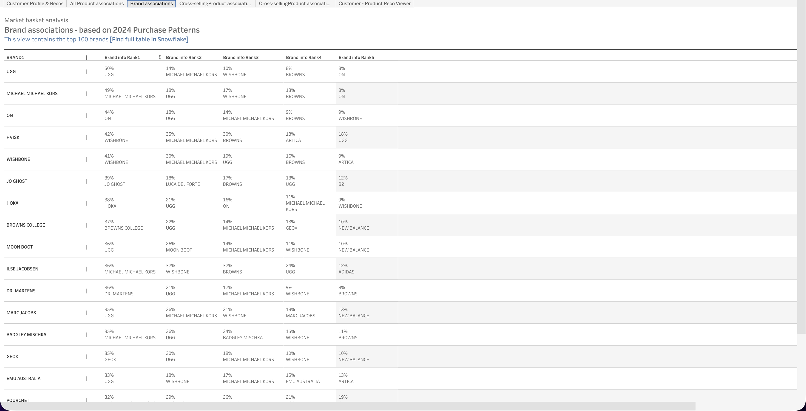
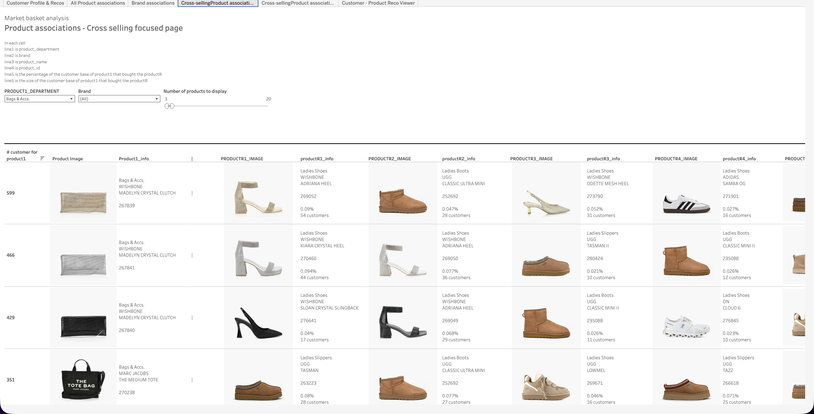
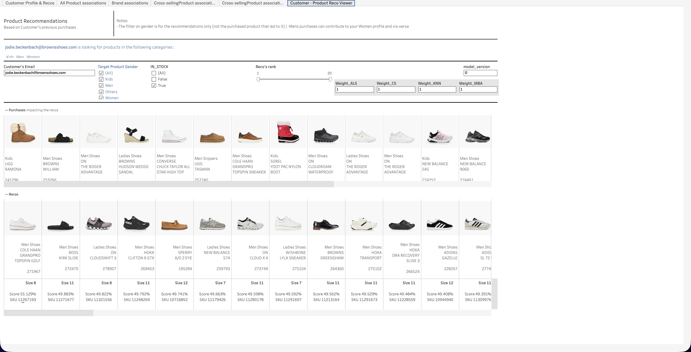

  <h1>Product Intelligence (Recos and Shopping Patterns)</h1>
  <a class="report-link" target="_blank" href="https://prod-ca-a.online.tableau.com/#/site/brownsshoes/workbooks/1251974/views">Open in Tableau</a>

  
<strong>Status:</strong> Testing

  
<strong>Category:</strong> Others

  
<strong>Last updated:</strong> February 22, 2026

  

    <button class="tab-btn active" data-tab="tab-profile">Customer Profile & Recos</button>
    <button class="tab-btn" data-tab="tab-product-assoc">All Product associations</button>
    <button class="tab-btn" data-tab="tab-brand">Brand associations</button>
    <button class="tab-btn" data-tab="tab-cross-visual">Cross selling (visual)</button>
    <button class="tab-btn" data-tab="tab-cross-table">Cross selling (table)</button>
    <button class="tab-btn" data-tab="tab-reco-viewer">Product Reco Viewer</button>
  

  

    
Individual customer lookup by email. Displays a customer profile summary -- first/last order dates, return rate, regular price %, favorite brand, province, and gender split across Women/Men/Kids products. Below, shows the customer's full purchase history with product images, followed by personalized product recommendations.

    
  

  

    
Market basket analysis showing product associations based on 2024 purchase patterns. For each reference product, displays the top co-purchased products with images in a visual grid. Filterable by recommendation model (e.g. CALC_mba, CALC_mba_broad_dept_lvl) and number of customers threshold.

    
  

  

    
Brand affinity table showing the top co-purchased brands based on 2024 purchase patterns. For each brand, ranks the most associated brands by purchase frequency (e.g. UGG customers also buy Michael Michael Kors, Wishbone, Browns). Link to full table in Snowflake for the top 100 brands.

    
  

  

    
Cross-selling focused page filtered by product department and brand. For each product, shows the most commonly cross-sold items with product images and customer counts. Useful for merchandising teams to identify complementary products within specific categories.

    
  

  

    
Detailed table view of the cross-selling data. For each product, lists the top 10 associated products with recommendation rank, purchase percentage, customer base percentage, and full product details (brand, name, department, gender). Filterable by department, brand, and customer base percentage range.

    
  

  

    
Customer-specific product recommendation viewer with model version selector and tunable scoring weights (Association Score, Collaborative Score, KNN, MBA). Shows the customer's purchase history alongside scored recommendations with product images, sizes, and composite scores. Designed for testing and validating recommendation model outputs.

    
  

## Context

End-to-end product intelligence dashboard combining market basket analysis, brand affinity, cross-selling recommendations, and personalized customer product recommendations. Powered by Snowflake python notebooks that compute association rules and collaborative filtering models. Used by merchandising and CRM teams to understand shopping patterns and validate recommendation engine outputs.

## Data Source

**Snowflake:** Python notebooks (market basket analysis, collaborative filtering, KNN models)
