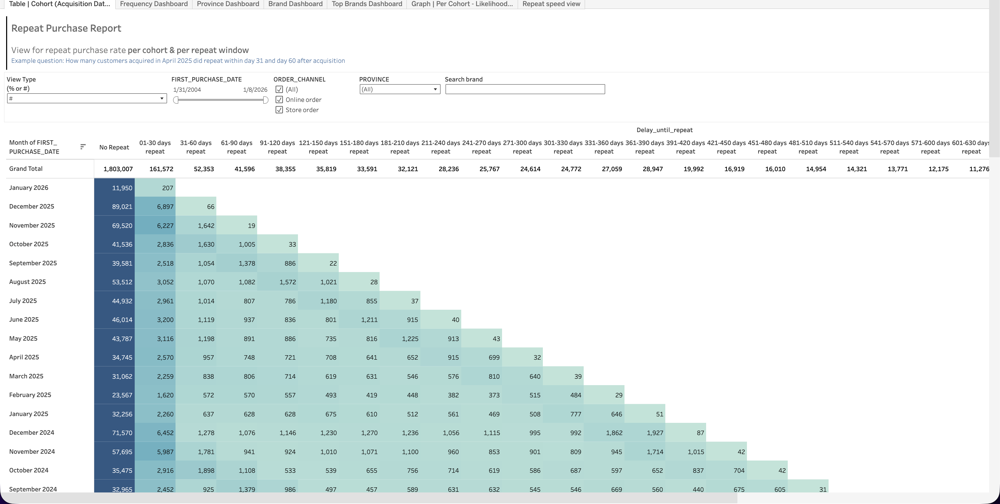
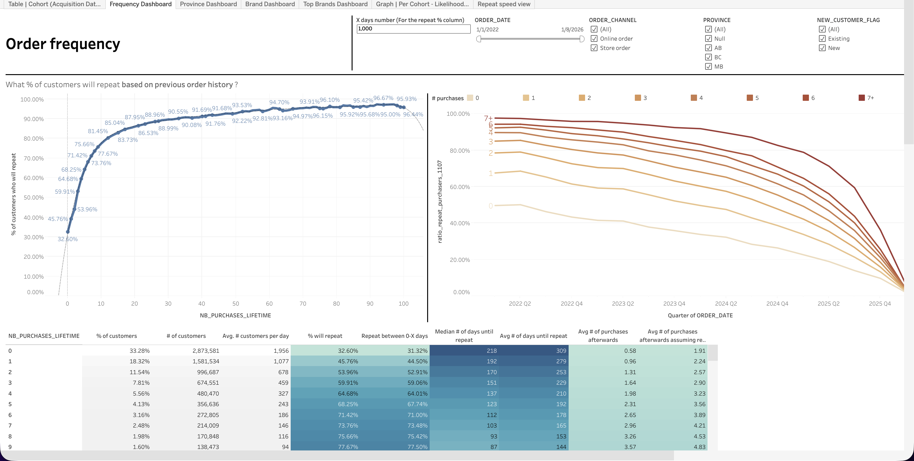
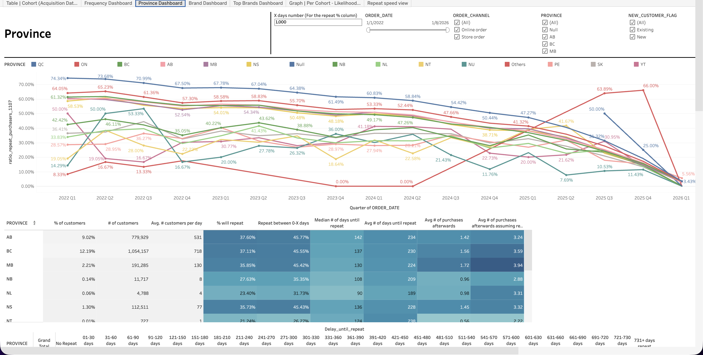
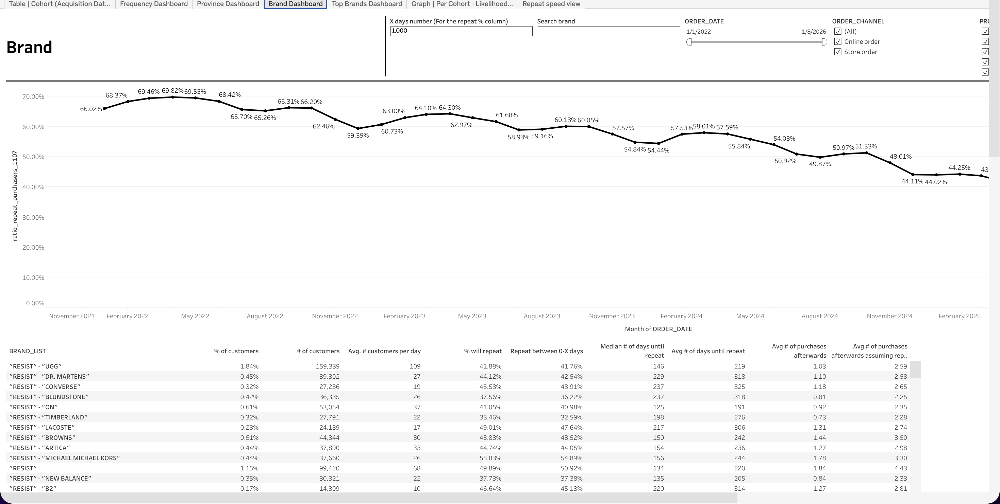
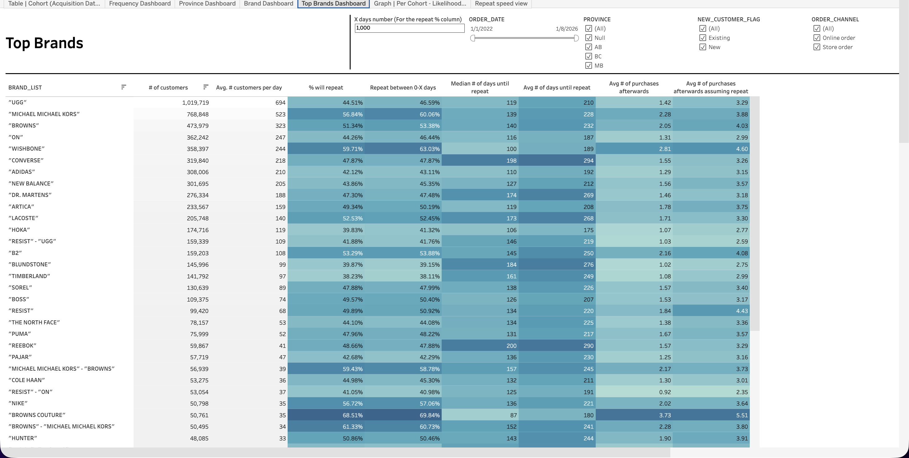
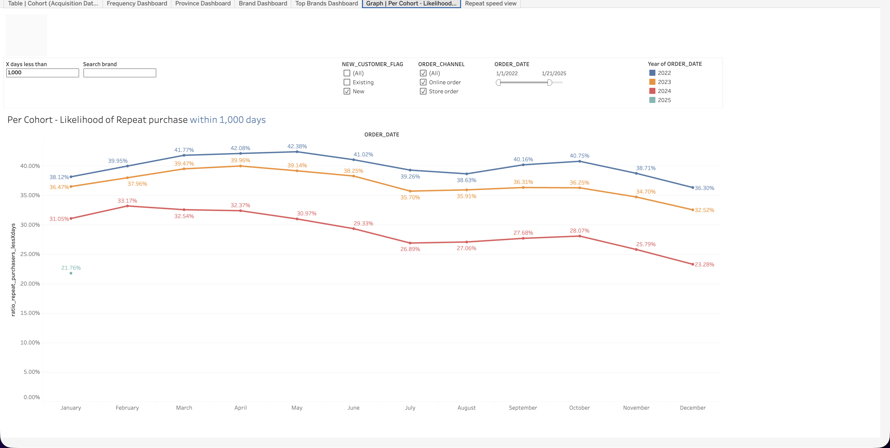
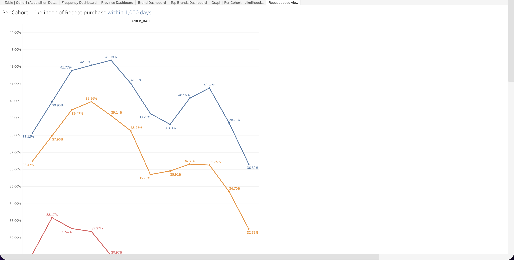

  <h1>Repeat Purchase Report 2026</h1>
  <a class="report-link" target="_blank" href="https://prod-ca-a.online.tableau.com/#/site/brownsshoes/workbooks/1766303/views">Open in Tableau</a>

  
<strong>Status:</strong> Testing

  
<strong>Category:</strong> Marketing / Self-Serve

  
<strong>Last updated:</strong> February 22, 2026

  

    <button class="tab-btn active" data-tab="tab-cohort">Cohort (Acquisition Date)</button>
    <button class="tab-btn" data-tab="tab-frequency">Frequency Dashboard</button>
    <button class="tab-btn" data-tab="tab-province">Province Dashboard</button>
    <button class="tab-btn" data-tab="tab-brand">Brand Dashboard</button>
    <button class="tab-btn" data-tab="tab-top-brands">Top Brands Dashboard</button>
    <button class="tab-btn" data-tab="tab-likelihood">Per Cohort - Likelihood</button>
    <button class="tab-btn" data-tab="tab-speed">Repeat speed view</button>
  

  

    
Repeat purchase rate by monthly acquisition cohort and delay window. Rows are first-purchase months, columns are time-to-repeat buckets (31-60 days, 61-90, up to 601-630 days). Shows how quickly each cohort returns for a second purchase. Filterable by view type, date range, order channel, province, and brand.

    
  

  

    
Order frequency analysis showing what % of customers will repeat based on previous order history. Left chart displays a cumulative curve of repeat likelihood by number of lifetime purchases. Right charts show repeat curves by purchase number over time. Summary table includes % will repeat, repeat-within-X-days rates, median days until repeat, and average purchases afterward.

    
  

  

    
Repeat purchase rate trends by province over time. Line chart tracks each province's repeat rate by quarter. Summary table shows customer count, avg customers per day, % will repeat, repeat-within-X-days, median and average days until repeat, and avg purchases afterward. Heatmap coloring highlights relative performance.

    
  

  

    
Repeat purchase rate trends by brand over time. Line chart shows repeat rate evolution by month for top brands. Table below lists brand-level metrics including % of customers, repeat rates, days to repeat, and average subsequent purchases. Searchable by brand name.

    
  

  

    
Ranked table of all brands by customer volume with repeat purchase metrics. Shows # of customers, avg customers per day, % will repeat, repeat-within-X-days, avg days until repeat, and avg purchases afterward. Heatmap coloring for quick visual comparison across brands. Filterable by province, new/existing customer flag, and order channel.

    
  

  

    
Monthly likelihood of repeat purchase within 1,000 days, with year-over-year comparison (2022-2025). Each line represents a year, showing how repeat probability varies by month of first purchase. Useful for identifying seasonal patterns in customer retention and tracking YoY improvement or decline.

    
  

  

    
Focused view on repeat purchase likelihood trends over time. Zoomed-in perspective on the same cohort likelihood data, making it easier to compare year-over-year shifts in repeat behavior at a monthly granularity.

    
  

## Context

Comprehensive repeat purchase analysis covering every angle of customer retention: when customers come back (cohort delay windows), how purchase frequency drives future behavior, how retention varies by geography and brand, and how repeat likelihood trends year over year. Built to help the CRM team identify retention levers and measure the impact of loyalty initiatives.

## Data Source

**Snowflake model:** `PROD_SANDBOX.ADIOP.customer_spend_summary`
