# [Project Name – Short Tagline](../)

  

    
<strong>Project:</strong> Full Project Name

    
<strong>Owner:</strong> Your Name — Department/Team

    
<strong>Status:</strong> 📋 Development

    
<strong>Demo:</strong> <a href="https://link-to-demo">Live Demo</a>

  

## 🎯 Problem
[Describe the business problem in 1-2 paragraphs. Include specific pain points and metrics where possible. Make it clear why this problem matters to Browns.]

## 💡 Solution  
- [Key feature or approach #1]
- [Key feature or approach #2]
- [Key feature or approach #3]
- [Optional: Key feature #4]

## 📈 Why It Matters
- [Business impact metric #1 - e.g., "Reduces X by Y%"]
- [Business impact metric #2 - e.g., "Saves Z hours per week"]
- [Business impact metric #3 - e.g., "Increases revenue by $X"]
- [Optional: Long-term strategic benefit]

## 🔧 How [Project Name] Works

### High-level Architecture Diagram

```mermaid
graph TB
    %% Title styling
    subgraph Input["<b>Data Input</b>"]
        A[📥 Source Data] --> B[🔄 Processing]
    end
    
    subgraph Processing["<b>Core Logic</b>"]
        B --> C[🧠 Algorithm/Model]
        C --> D[📊 Analysis]
    end
    
    subgraph Output["<b>Results</b>"]
        D --> E[💾 Storage]
        E --> F["📈 <b>Dashboard/Output</b>"]
    end
    
    %% Styling
    classDef inputStyle fill:#fff,stroke:#000,stroke-width:2px
    classDef processStyle fill:#e8eaf6,stroke:#9fa8da,stroke-width:2px
    classDef outputStyle fill:#e8f5e9,stroke:#66bb6a,stroke-width:3px
    
    class A,B inputStyle
    class C,D processStyle
    class E,F outputStyle
```

## 🛠️ Technical Components

### 📊 Data Layer
**[Technology/Tool Name]** – [Explanation of what this component does, why it was chosen, and any key features. Keep to 2-3 sentences.]

### 🎯 Processing Layer
**[Technology/Tool Name]** – [Explanation of the core processing logic, algorithms, or models used. Mention performance characteristics if relevant.]

### 🖥️ Interface Layer
**[Technology/Tool Name]** – [Description of how users interact with the system, whether through UI, API, or other means.]

### ☁️ Infrastructure
**[Technology/Tool Name]** – [Details about deployment, scaling, and operational aspects.]

### 🔐 Security & Compliance
**[Approach/Tool]** – [How the system handles data security, privacy, and any compliance requirements.]

---

*Last updated: YYYY-MM-DD*