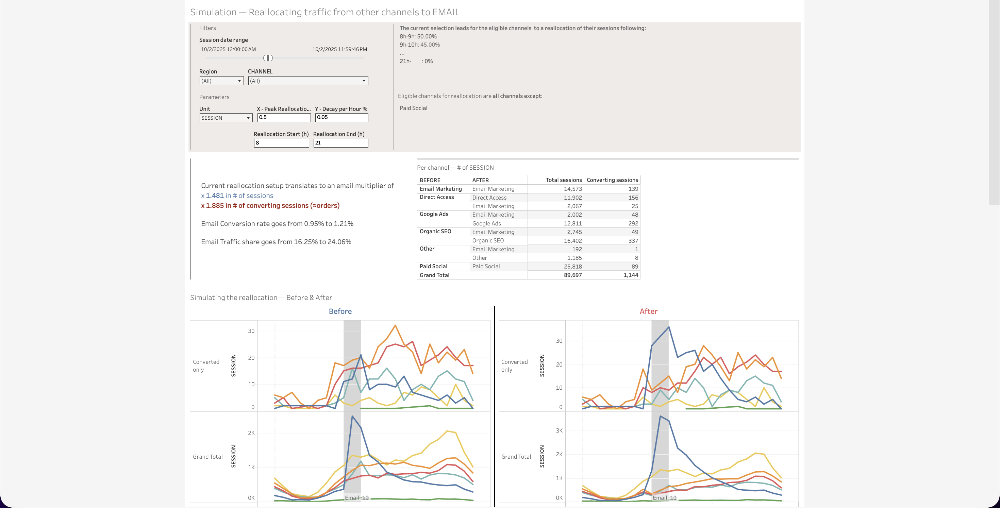

  <h1>Traffic Reallocation to Email</h1>
  <a class="report-link" href="https://prod-ca-a.online.tableau.com/#/site/brownsshoes/workbooks/1760092/views">Open in Tableau</a>

  
<strong>Status:</strong> Testing

  
<strong>Category:</strong> Others

  
<strong>Last updated:</strong> February 22, 2026

  

    <button class="tab-btn active" data-tab="tab-simulation">Simulation</button>
  

  

    
Simulates the impact of reallocating web traffic from other channels to email. Configurable parameters include date range, region, channel, peak reallocation %, decay per hour, and reallocation time window. Shows the resulting email multiplier effect on sessions and converting sessions. Per-channel table breaks down before/after session counts and conversions. Before & After line charts compare session patterns across channels for converted-only and grand total views.

    
  

## Context

What-if simulation tool for the marketing team to model the effect of shifting web traffic from paid/organic channels into email. Helps quantify how email conversion rate and traffic share would change under different reallocation scenarios, supporting budget and channel mix decisions.

## Data Source

**Snowflake model:** `prod_sandbox.ADIOP.session_funnel_steps_with_TS`
