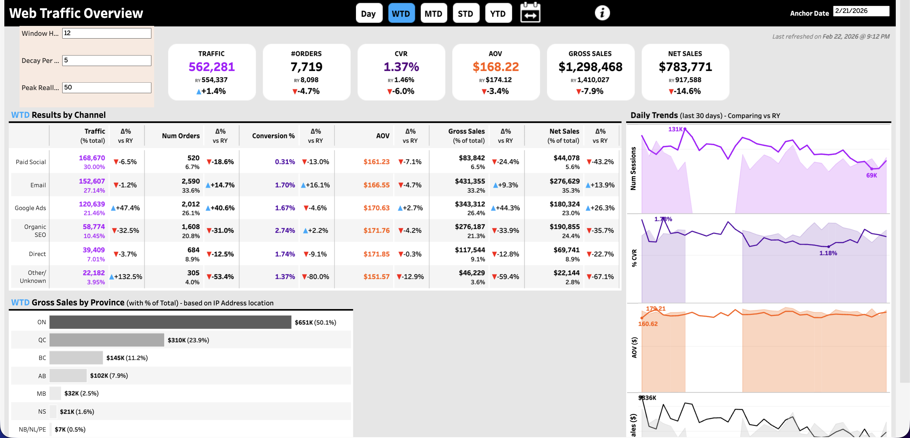

  <h1>WEB Traffic with reallocation to Email</h1>
  <a class="report-link" target="_blank" href="https://prod-ca-a.online.tableau.com/#/site/brownsshoes/workbooks/1904487/views">Open in Tableau</a>

  
<strong>Status:</strong> Testing

  
<strong>Category:</strong> Marketing / Self-Serve

  
<strong>Last updated:</strong> February 25, 2026

  

    <button class="tab-btn active" data-tab="tab-overview">Web Traffic Overview</button>
  

  

    
Web traffic dashboard with email reallocation applied. Top KPIs show traffic, # orders, conversion rate, AOV, gross sales, and net sales with YoY deltas. Toggleable by Day, WTD, MTD, STD, YTD, and custom anchor date. Results by Channel table breaks down Paid Social, Email, Google Ads, Organic SEO, Direct, and Other with traffic %, conversion %, AOV, gross/net sales, and YoY changes. Includes gross sales by province (based on IP address) and daily trends chart comparing vs prior year.

    
  

## Context

Unified web traffic report that incorporates email send window reallocation logic — attributing sessions that occur within a configurable window after an email send back to the Email channel. Provides a corrected view of channel performance by accounting for email-driven traffic that would otherwise be attributed to Direct or Organic. Also includes a Custom Range view for ad-hoc date comparisons.

## Data Source

**Snowflake model:** `PROD_SANDBOX.ADIOP.SESSIONS_WITH_SEND_WINDOW` + production tables
